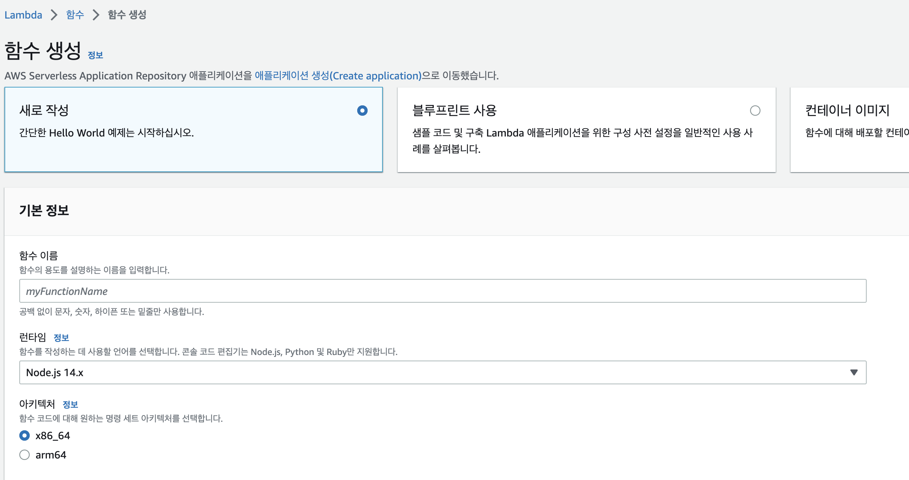
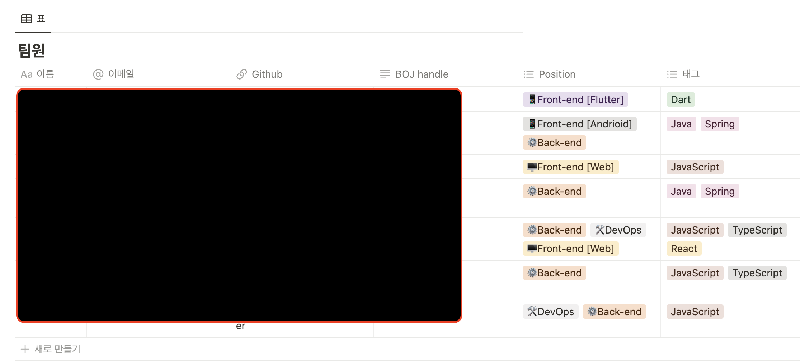
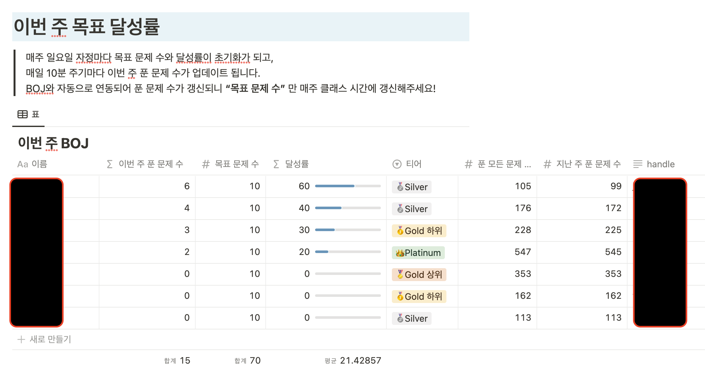
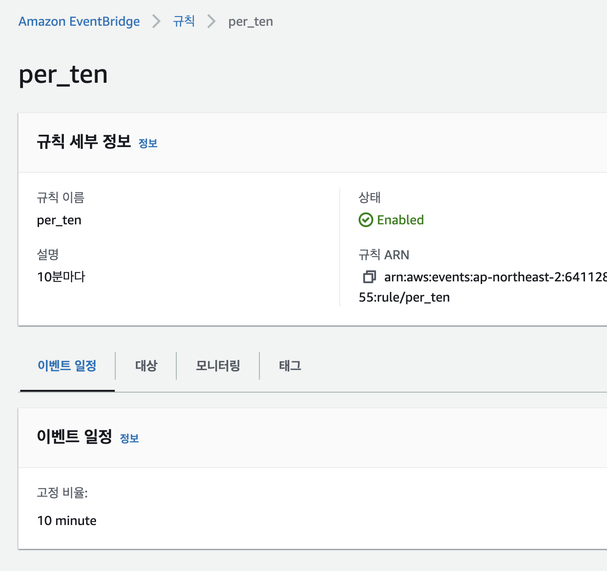

# Notion-BOJ-bot

**누구를 위해** - 알고리즘 스터디, 클래스를 운영중인 운영진을 위해

**어떤 것을** - Notion에 참여자들의 BOJ(알고리즘 문제해결 사이트) 아이디만 올리면 자동으로 이번 주, 참여자들이 푼 알고리즘 문제들 개수를 갱신시켜주는 서비스를

**어떻게** - AWS 서버리스 서비스인 Lambda를 통해 무료로 배포해 사용할 수 있습니다.

---

## 사용 방법

### 1. AWS 계정과 Lambda 서비스의 활용 방법에 대해 알아야 합니다.

먼저 AWS 계정을 만들어주세요. 그리고 AWS Lambda 서비스로 접속해 함수들을 생성해야 합니다. 서버리스 서비스인 [Lambda의 활용방법](https://aws.amazon.com/ko/lambda/)에 대해 궁금하신 분들은 링크를 참조해주세요.

### 2. Lambda 함수를 생성해주세요.

기본적으로 NodeJS 런타임을 사용합니다. 14 버전에서 가장 안정적이니 되도록 해당 버전에서 사용해주세요.

### 3. src 디렉토리의 소스를 복사해 함수 코드에 붙여넣어 주세요.

### 4. 3개의 환경변수를 추가해주세요.

3개의 환경변수가 필요합니다. 먼저 스터디에 참여 중인 구성원들의 BOJ ID가 수록되어 있는 notion Database의 ID 값, 구성원들의 이번 주 풀이한 문제 개수가 업데이트 될 notion Database ID 값이 필요합니다. 마지막으로 Notion Key값 또한 필요한데, 이 값들을 가져오는 방법은 하단의 저의 블로그를 참고해주시길 바랍니다.

[https://newdeal123.tistory.com/86](https://newdeal123.tistory.com/86)

[https://newdeal123.tistory.com/87](https://newdeal123.tistory.com/87)

를 참고해주시길 바랍니다.

notion BOJ_Database는 다음과 같이 만들어져야 하는데, 테이블 각 칼럼의 이름이 모두 스크린샷과 동일해야 동작하니, 참고해주세요.   

notion TEAM_Database는 다음과 같이 만들어져야 하는데, 테이블 각 칼럼의 이름이 모두 스크린샷과 동일해야 동작하니, 참고해주세요.   

### 5. 함수가 실행될 패키지가 포함된 Layer들을 추가해주세요.

layer 디렉터리의 압축파일을 Lambda Layer로 추가해주세요.

### 6. 주기적인 업데이트를 위해서 AWS EventBridge를 추가해주세요.

다음과 같이 10분마다 실행되도록 규칙을 설정해 Lambda와 이어주기만 하면 완성입니다.

이후 BOJ_Database에 등록된 구성원들의 BOJ 푼 문제들이 자동으로 갱신됩니다.

---

## 구현 방법

[Notion API](https://developers.notion.com/reference/intro) 와 [Solved.ac API](https://solvedac.github.io/unofficial-documentation/#/)를 활용해 직접 제작하였습니다.

## License
 
CC0-1.0 license
